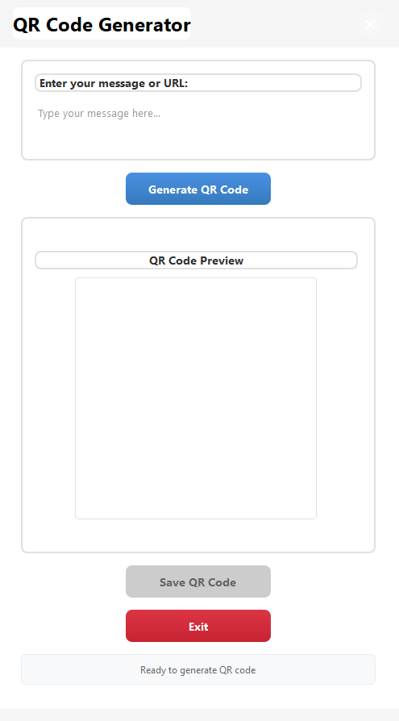

# QR Code Generator

A modern, professional desktop application for generating and saving QR codes with a beautiful PySide6-based user interface.


## ✨ Features

- **Modern UI Design**: Clean, professional interface with rounded corners and smooth gradients
- **Multi-line Input**: Support for URLs, text messages, contact information, and more
- **Real-time Preview**: Instant QR code generation with live preview
- **High Quality Output**: Generate high-resolution QR codes suitable for printing
- **Easy Export**: Save QR codes as PNG files with custom naming
- **Cross-platform**: Works on Windows, macOS, and Linux
- **Customizable**: Adjustable QR code parameters and styling

## 🚀 Installation

### Prerequisites
- Python 3.8 or higher
- pip package manager

### Quick Start
1. Clone the repository:
```bash
git clone https://github.com/yourusername/gen_qrcodes.git
cd gen_qrcodes
```

2. Install dependencies:
```bash
pip install -r requirements.txt
```

3. Run the application:
```bash
python qr_code_app.py
```

## 📦 Dependencies

- **PySide6** ≥6.5.0 - Modern Qt framework for Python
- **qrcode[pil]** ≥7.4.0 - QR code generation library
- **Pillow** ≥9.5.0 - Image processing library

## 🎯 Usage

### Basic Operation
1. **Enter Text**: Type your message, URL, or contact information in the text area
2. **Generate**: Click the "Generate QR Code" button to create your QR code
3. **Preview**: View the generated QR code in the preview window
4. **Save**: Click "Save QR Code" to export as a PNG file

### Supported Content Types
- **URLs**: `https://www.example.com`
- **Text Messages**: `Hello World!`
- **Contact Information**: `Contact: john@email.com`
- **WiFi Networks**: `WIFI:S:NetworkName;T:WPA;P:Password;H:false;;`
- **Phone Numbers**: `tel:+1234567890`
- **Email**: `mailto:user@example.com`

## 🎨 Features in Detail

### User Interface
- **Custom Title Bar**: Draggable window with clean design
- **Responsive Layout**: Adapts to different window sizes
- **Professional Styling**: Modern color scheme with hover effects
- **Intuitive Controls**: Clear button labels and status messages

### QR Code Generation
- **Error Correction**: Medium level error correction for reliability
- **Optimized Sizing**: Automatic sizing based on content
- **High Resolution**: 300x300 pixel preview with scalable output
- **Format Support**: PNG export with transparent background option

## 🔧 Customization

### QR Code Parameters
The application uses these default settings:
- **Version**: Auto-detected based on content
- **Error Correction**: Medium (M) - 15% recovery capability
- **Box Size**: 8 pixels per module
- **Border**: 2 modules for optimal scanning

### UI Customization
- Colors and styling can be modified in the `setStyleSheet` calls
- Window dimensions are configurable in the `__init__` method
- Button sizes and layouts can be adjusted as needed

## 📱 Screenshots



## 🛠️ Development

### Project Structure
```
gen_qrcodes/
├── qr_code_app.py      # Main application file
├── requirements.txt     # Python dependencies
├── README.md           # This file
└── .gitignore          # Git ignore file
```

### Key Components
- **CustomTitleBar**: Custom window title bar with drag functionality
- **QRCodeApp**: Main application class with UI setup
- **QR Generation**: Integrated qrcode library for code creation
- **Image Handling**: PIL/Pillow integration for image processing

## 🤝 Contributing

Contributions are welcome! Please feel free to submit a Pull Request. For major changes, please open an issue first to discuss what you would like to change.

### Development Setup
1. Fork the repository
2. Create a feature branch (`git checkout -b feature/AmazingFeature`)
3. Commit your changes (`git commit -m 'Add some AmazingFeature'`)
4. Push to the branch (`git push origin feature/AmazingFeature`)
5. Open a Pull Request

## 📄 License

This project is licensed under the MIT License - see the [LICENSE](LICENSE) file for details.

## 🙏 Acknowledgments

- **PySide6**: Modern Qt bindings for Python
- **qrcode**: Python library for generating QR codes
- **Pillow**: Python Imaging Library for image processing

## 📞 Support

If you encounter any issues or have questions:
- Open an issue on GitHub
- Check the existing issues for solutions
- Review the code comments for implementation details

---

**Made with ❤️ using Python and PySide6**

*Generate professional QR codes with style!*
